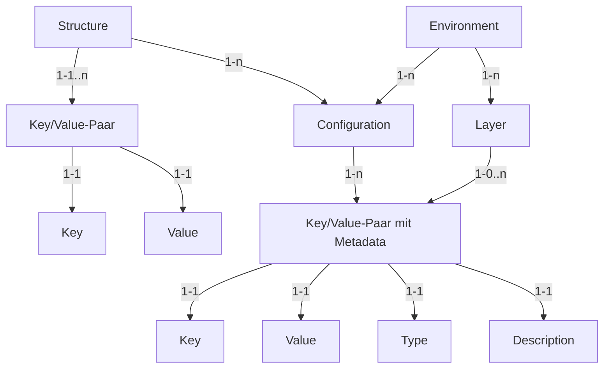
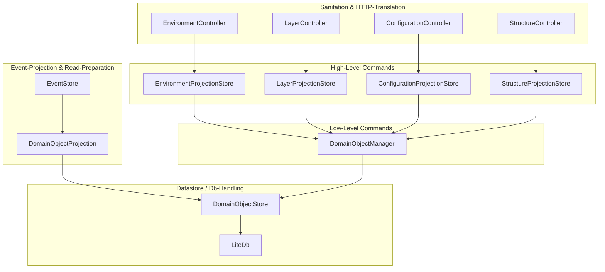
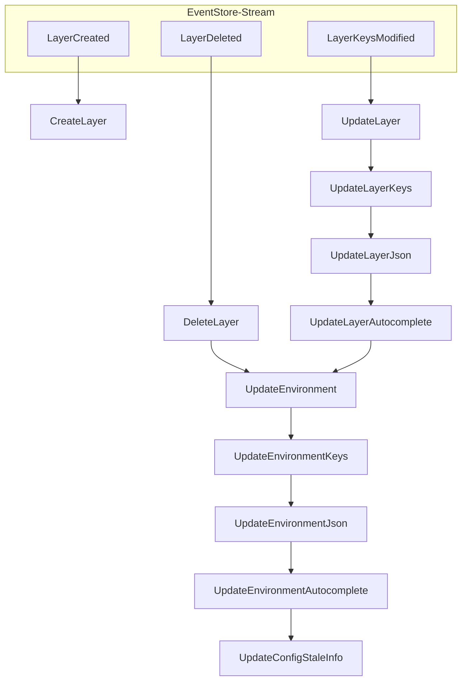

# Config Service 2.0

[[_TOC_]]

## Overview

Der neue ConfigService basiert auf der Idee, dass eine Konfiguration aus Umgebungsvariablen + Struktur besteht.

- Struktur
- Environment / Umgebungsvariablen
- Konfiguration

### DomainModell

Das Domänenmodell des ConfigService besteht aus folgenden Objekten:
- Umgebung (`Environment`)
    - Name
    - Kategorie
    - Liste von zugewiesenen Ebenen
- Ebene (`Layer`)
    - Name
    - Menge von Key/Value-Paaren mit Metadaten
- Struktur (`Structure`)
    - Name
    - Version
    - Menge von Key/Value-Paaren
- Konfiguration (`Configuration`)
    - Erstellt aus Umgebung+Struktur
    - Identifiziert durch Umgebung+Struktur
    - Menge von Key/Value-Paarent mit Metadaten

Genauere Informationen zu diesen Objekten stehen unten zur Verfügung.



### Struktur

Eine Struktur im kontext des ConfigServices beschreibt wie Umgebungsvariablen zusammengesetzt werden um eine Funktionierende Konfiguration zu erstellen.  
Im Kontext einer Anwendung die seine Konfiguration über den ConfigService bezieht, beschreibt eine Struktur wie diese Anwendung seine Konfiguration erwartet.  
Die Struktur sollte mit in das Code-Repository der Anwendung eingecheckt werden.
Sollte sich das Layout der erwarteten Konfiguration ändern, muss die Struktur-Version erhöht werden.

Eine Struktur kann komplett aus festen Werten bestehen, oder aus Referenzen auf die Umgebungsvariablen, oder aus einer Mischung beider.
Eine Struktur wird dem ConfigService als `JSON`-Dokument bekannt gemacht und sieht in etwa so aus:

``` json
{
    "name": "Bechtle.A365.AdminService",
    "version": 1,
    "structure": {
        "ClientConfiguration": {
            "authority": "{{NamedEndpoints/IdentityService/Uri}}",
            "client_id": "A365.AdminService.FrontEnd",
            "locale": "de",
            "post_logout_redirect_uri": "{{NamedEndpoints/AdminService/Uri}}",
            "redirect_uri": "{{NamedEndpoints/AdminService/Uri}}",
            "response_type": "id_token token",
            "scope": "openid profile A365.WebApi.Query",
            "service_status_refresh_rate": "10000"
        },
        "Endpoints": "{{Endpoints/*}}",
        "LoggingConfiguration": "{{LoggingConfiguration/ImplementationConfiguration}}"
    },
    "variables": {
        "ServiceName": "Bechtle.A365.AdminService"
    }
}
```

- `name` ist der _**unique**_ key zu dieser Struktur
- `version` ist der _**unique**_ identifier zu dieser `structure`
- `structure` ist der logische aufbau dieser konfiguration
- `variables` sind (optionale) Struktur-Lokale variablen auf die die Umgebungsvariablen zugreifen können

Eine Struktur kann mittels `{{Command: Value; Command2: Value2}}` auf bestimmte Werte oder ganze Regionen der Umgebungsvariablen zugreifen.
Mehr dazu unter [Referenzen & Parsing](#referenzen--parsing)

> WICHTIG  
> Eine einmal hochgeladene Struktur-Version kann nicht wieder gelöscht werden.  
> Die Struktur-Version sollte nur dann verändert werden, wenn sich der Aufbau der Konfiguration für die Anwendung verändert hat.  
> Aus diesem Grund sollten so wenig Feste Werte wie möglich in eine Struktur eingetragen werden

### Layer

Ein Layer besteht aus einem Namen und einer Menge von Key->Value Paaren.  
Diese Key/Value Paare können zur Ansicht in verschiedene Formate projiziert (Json), aber nur über ihre Key/Value Ansicht verändert werden.

Key/Value Einträge können auf andere Einträge verlinken ([Referenzen & Parsing](#referenzen--parsing)).  
Diese Referenzen werden erst zur Bau-Zeit einer Konfiguration aufgelöst, und können dadurch dynamisch ihren Wert verändern abhängig davon welche Layer in dem Environment geladen wurden (mehr Informationen zu Layer-Overloading unter [Environment](#environment))

### Environment

Ein Environment wird unter einer Kategorie -> Name Hierarchie gespeichert und besteht aus einer numerierten Liste von Layer-Ids.  
Die Reihenfolge in der diese Layer-Ids eingetragen werden bestimmt, welche Daten in diesem Environment verfügbar sind.

Für jedes Layer, angefangen von Position 1 (Index 0), werden alle Key/Value-Einträge in das aktuelle Environment geladen.  
Sollte eine `Key` mit dem selben Namen bereits in das Environment geladen worden sein, wird dieser mit dem neuen `Value` überschrieben.

Szenario:  
Layer A und B haben unterschiedliche Werte für den selben Key.  
Je nachdem welches Layer (A/B) geladen wird, ist der Wert des Keys der von A oder B.

Layer A
```json
{
  "Foo": "42"
}
```

Layer B
```json
{
  "Foo": "4711"
}
```

Layer C
```json
{
  "Bar": "Something"
}
```

Environment A
1. Layer A
2. Layer C
```json
{
  "Foo": "42",
  "Bar": "Something"
}
```

Environment B
1. Layer B
2. Layer C
```json
{
  "Foo": "4711",
  "Bar": "Something"
}
```

Environment C
1. Layer A
2. Layer B
   - überschreibt die Werte von `Layer A`
3. Layer C
```json
{
  "Foo": "4711",
  "Bar": "Something"
}
```

> WICHTIG:  
> Das Ergebnis dieser Aktion beeinflusst die Ergebnisse aller Referenzen.

### Konfiguration

Eine Konfiguration wird aus einer Struktur und einem Environment erstellt, und ist optional zeitlich begrenzt.  
Eine Konfiguration wird immer mit der aktuellen / letzten Version eines Environments und der angegebenen Version einer Struktur erstellt.  
Eine Konfiguration wird aus sicht der Struktur erstellt. Alle Keys, die in der Struktur eingetragen wurden, werden mit dem angegeben Environment aufgelöst.

### Anbindung von Services

Alle Services, die mit dem ConfigService interagieren sollen, sollten/müssen diese Liste befolgen:

1. Die Anwendung prüft ob die gewünschte Konfiguration abrufbar ist.
    - Hierfür braucht die Anwendung folgende Informationen
        - Environment-Kategorie
        - Environment-Name
        - Struktur-Name
        - Struktur-Version
2. Abhängig davon, ob die Konfiguration verfügbar ist, wird 2.1 oder 2.2 ausgeführt
    1. (Konfiguration verfügbar) Applikation lädt Konfiguration und startet - gehe zu 3.
    2. (Konfiguration nicht verfügbar) 
        1. Applikation lädt Struktur hoch
        2. Applikation versucht Konfiguration mit ursprünglichen Informationen zu bauen
        3. Applikation versucht für eine bestimmte Zeit die Konfiguration zu laden
        4. Falls Konfiguration geladen werden kann, gehe zu 2.1
        5. Falls Konfiguration nicht geladen werden kann, starte Anwendung ohne Konfiguration - gehe zu 3.
3. (Optional) Eine Anwendung kann auf bestimmte Events hören und ggf. Daten neu laden und sich re-konfigurieren
    1. Für mehr Informationen siehe [Hören auf Config-Events](#reagieren-auf-config-events)

#### Reagieren auf Config-Events

Der ConfigService hat einen Endpunkt `/v1/connections/events`, über den eine Anwendung den vom ConfigService genutzten SignalR-Server abfragen kann.  
Über diesen SignalR-Server werden foglende Events herausgegeben:
- `Bechtle.A365.ConfigService.Common.Events.TemporaryKeysAdded`
    - Gesendet wenn Temporäre Keys über `Post /v1/temporary/{structure}/{structureVersion}` gesetzt werden
- `Bechtle.A365.ConfigService.Common.Events.TemporaryKeysExpired`
    - Gesendet wenn Temporäre Keys ablaufen oder entfernt werden
- `Bechtle.A365.Core.EventBus.Events.Events.OnConfigurationPublished`
    - Gesendet wenn eine neue Konfiguration erstellt wird

#### Anbindung von .Net Services

Um einen .Net Service an den ConfigService anzubinden müssen folgende schritte befolgt werden:

1. Der Service muss die [Client-Library](https://shdebonvtfs1.bechtle.net/DefaultCollection/A365/_git/a365.RestClient.ConfigService) referenzieren und beim Programm-Start zu seinem `IConfigurationBuilder` hinzufügen

In Asp.Net Core 2.0 und folgend erfolgt dies z.B. so:

```csharp
// Program.cs

public static void Main(string[] args) => BuildWebHost(args).Run();

public static IWebHost BuildWebHost(string[] args)
    => WebHost.CreateDefaultBuilder(args)
              .ConfigureAppConfiguration((context, builder) => ConfigureApp(context, builder, args))
              .UseStartup<Startup>()
              .Build();

private static void ConfigureApp(WebHostBuilderContext builderContext,
                                 IConfigurationBuilder builder,
                                 string[] args)
{
    // clear all current sources - may or may not be useful for you
    builder.Sources.Clear();

    // load the configuration used to find the ConfigService
    var preConfig = new ConfigurationBuilder().AddJsonFile("appsettings.json", true)
                                              .AddEnvironmentVariables()
                                              .AddCommandLine(args)
                                              .Build();

    // this is all we need to reach the ConfigService
    var configSettings = preConfig.GetSection("Configuration")
                                  .Get<ConfigurationSettings>();

    // defining the sources in this order provides us with an easy way to override settings locally
    // useful for developing or testing
    // more sources can be added here if you wish
    builder.AddA365ConfigurationSource(configSettings)
           .AddJsonFile("appsettings.json", true, true)
           .AddEnvironmentVariables()
           .AddCommandLine(args);
}
```

2. In einer der Sources, die für die `preConfig` genutzt werden, müssen folgende Informationen vorhanden sein:

``` json
{
    "Configuration": {
        "Endpoint": "http://a365configurationservice.a365dev.de",
        "EnvironmentCategory": "av360",
        "EnvironmentName": "dev",
        // one of the following must be set
        // Option 1.
        // Allows for Request + Upload + Building
        "StructureLocation": "configStructure.json",
        // Option 2.
        // Only allows Request + Building
        "StructureName": "Bechtle.A365.AdminService",
        "StructureVersion": 1
    }
}
```

3. Erstelle eine Struktur-Datei in der die aktuelle Struktur eingetragen wird, siehe [Struktur](#struktur) für das Format
4. `StructureLocation` muss von dem working-directory bei runtime auf eine valide Strukur-Datei zeigen
5. ???
6. Profit!

## Technische Details

### Technischer Overview

Der ConfigService besteht aus einem Read- und einem Write-Teil.  

Der Read-Teil des ConfigService greift auf vorbereitete Daten zu, und mach generell keine eigenen berechnungen.  
Der Write-Teil des ConfigService erwartet, dass der aktuell Projizierte Lese-Topf auf dem neuesten Stand ist, und schreibt neue Events basierend darauf in den Event-Stream.  

Beide Komponenten werden über den `IDomainObjectManager` koordiniert. Dieser übersetzt `GetConfiguration` in `Lade DomainObjct vom Typ PreparedConfiguration aus dem Store`, und `UpdateKeys` in `Lade DomainObject vom Typ EnvironmentLayer, aktualisiere Keys, schreibe Änderungen in Stream`.

Die wichtigsten Komponenten sind in diesem Diagram abgebildet:



### Event-Projektion

`DomainEventProjection` ist ein Hintergrundservice, der alle DomainEvents im Config-Stream in eine lokale Datenbank projiziert.  
Das bedeutet, dass die Änderungen die ein Event repräsentiert auf alle relevanten Objekte in der Datenbank angewandt werden, und alle anhängigen Daten aktualisiert werden.

Beispiel:



Diese Projektion wird auf allen Service-Instanzen ausgeführt und in eine Instanz-Lokale DB gespeichert.

### Referenzen / Parsing

Das Parsen der Config-Werte um Referenzen zu finden wird vom `IConfigurationParser` und der Konkreten implementation im `ConfigurationParser` übernommen.

Referenzen sind Key-Globale Instruktionen um einen Wert anzupassen.  
Damit ist folgendes gemeint:

> - Instruktionen in Referenzen können einen Kontext verändern der für diesen Key gilt.
> - Mehrere Referenzen können einen Wert ausmachen
> - Eine Referenz kann mehrere Werte ausmachen

Eine Referenz wird mit `{{` geöffnet und mit `}}` geschlossen.  
Innerhalb einer Referenz befinden sich 1..n Instruktionen.  
Eine Instruktion besteht aus einem Kommando und einem Wert: `Path: some/path/to/narnia`

Mögliche Kommandos sind:

- `Path`
- `Using`
- `Alias`

#### Path

Diese Referenz wird durch den / die Keys ausgetauscht die der Value angibt.  
Sollte Value mit `/*` enden wird dieser Value durch alle Keys ausgetauscht die Value matchen, und keine weiteren Kommandos werden verarbeitet.  
> Wenn kein Kommando angegeben wird, wird `Path` impliziert

#### Using &  Alias

Diese Kommandos können nur zusammen genutzt werden und haben alleine keine Auswirkungen

Beispiel:  
Folgende Referenz:  
`{{ Using: some/path/to/narnia; Alias: narnia; }}`

Erstellt einen Eintrag:  
`$narnia => 'some/path/to/narnia'`

Dieser Eintrag kann dann innerhalb des selben Kontexts (Selber Value) mit Angabe des Alias' genutzt werden:  
`{{$narnia/forest/castle/dungeon/cell}}`

Vollständiger Wert:  
`{{ Using: some/path/to/narnia; Alias: narnia; }}{{ $narnia/forest/castle/dungeon/cell }}`

Fertiger Wert:  
`some/path/to/narnia/forest/castle/dungeon/cell`

### Feste Aliases

Beim Parsen einer Referenz stellt der ConfigService2.0 bestimmte Aliases zur Verfügung, ohne dass diese vorher definiert werden müssen.

- `$this`
- `$struct`

#### This

`$this` wird automatisch durch den Pfad des direkten Parents ersetzt.

```json
{
    "some/path/to/narnia": "-",
    "some/path/to/somewhere": "{{$this/neverland}}"
}
```

#### Struct

`$struct` ist insofern speziell, als dass es Zugriff auf das `variables` objekt innerhalb einer Struktur erlaubt.

`{{$struct/MyVariable}}` greift auf `MyVariable` innerhalb der aktuellen Struktur zu.

## Known Issues

### Bestimmte Zeichen in JSON-Properties führen zu falschen Konfigurationen

JSON-Properties die `'/'` enthalten können zu Problemen führen, wenn sie nicht korrekt an den ConfigService übergeben werden.

``` json
{
  "TargetConfigurations": {
    "Ein-/Ausgang (Papier)": "Original",
    "Elektronisches Dokument": "Original",
    "TempDokument": "Original"
  }
}
```

Dieses JSON, als `Dictionary<string, string>` dargestellt, kann unterschiedliche Ergebnisse haben.

Fehlerhafte Darstellung:
> ``` json
> {
>   "TargetConfigurations/Ein-/Ausgang (Papier)": "Original",
>   "TargetConfigurations/Elektronisches Dokument": "Original",
>   "TargetConfigurations/TempDokument": "Original"
> }
> ```

Korrekte Darstellung:
> ```json
> {
>   "TargetConfigurations/Ein-%2FAusgang%20%28Papier%29": "Original",
>   "TargetConfigurations/Elektronisches%20Dokument": "Original",
>   "TargetConfigurations/TempDokument": "Original"
> }
> ```

Alle Pfade sind technisch korrekt, die "Fehlerhafte Darstellung" führt allerdings zu einem anderen JSON als gewollt.

``` json
{
  "TargetConfigurations": {
    "Ein-": {
        "Ausgang (Papier)": "Original"
    },
    "Elektronisches Dokument": "Original",
    "TempDokument": "Original"
  }
}
```

Der ConfigService2.0 wandelt JSON automatisch in das korrekte Format wenn der Endpunkt `/environments/{category}/{name}/json` genutzt wird.
Alternativ steht noch der Endpunkt `/environments/{category}/{name}/keys` zur Verfügung - dort wird allerdings davon ausgegangen dass die übertragenen Werte korrekt sind.  
Über die Endpunkte `/convert/json/map` und `/convert/map/json` können JSON und `Dictionary<string, string>` beliebig umgewandelt werden, falls der Client diese Aufgabe nicht übernehmen will.

